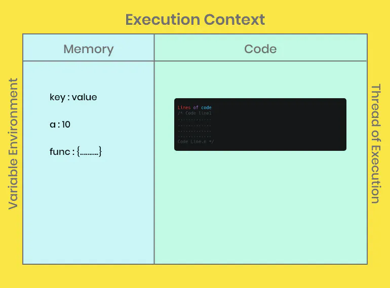
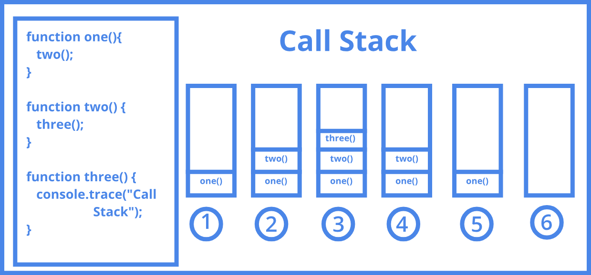
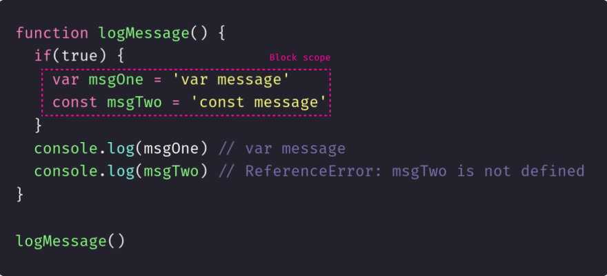
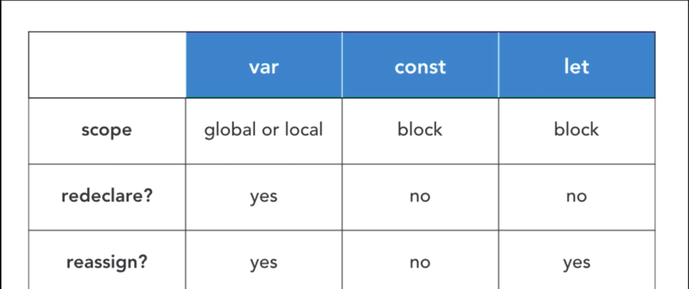
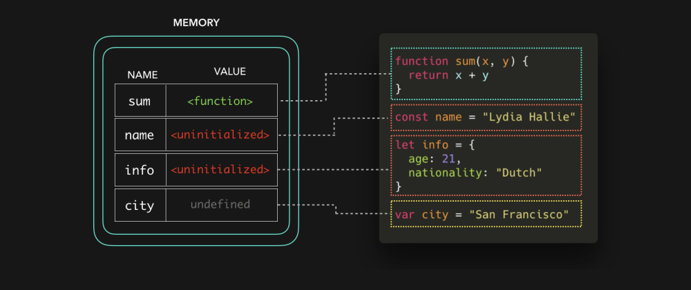
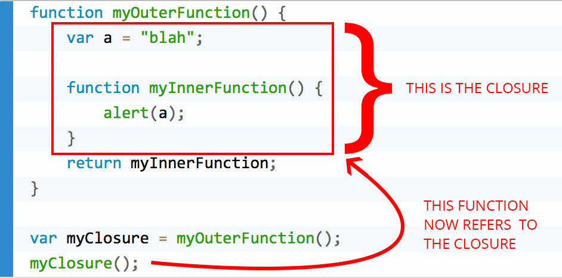

## Table of Contents <a name="table"></a>

-   [JavaScript Execution Context](#javascript-execution-context)
-   [Call Stack](#call-stack)
-   [Function Details](#function-details)
    -   [Function Declaration or Function Statement](#function-declaration-or-function-statement)
    -   [Function Expression](#function-expression)
    -   [Anonymous Function](#anonymous-function)
    -   [IIFE (Immediately Invoked Function Expression)](#iife-immediately-invoked-function-expression)
    -   [Arrow Function](#arrow-function)
    -   [First-Class Function or Higher-Order Function](#first-class-function-or-higher-order-function)
    -   [Callback Function](#callback-function)
    -   [Parameters vs Arguments](#parameters-vs-arguments)
-   [JavaScript Errors](#javascript-errors)
    -   [ReferenceError](#referenceerror)
    -   [SyntaxError](#syntaxerror)
    -   [TypeError](#typeerror)
    -   [AggregateError](#aggregateerror)
-   [JavaScript Scope & Scope Chain](#javascript-scope-chain)
-   [Variable Shadowing , let const [Solve memory leak problem]](#variable-shadowing)
-   [Javascript Hoisting](#javascript-hoisting)
-   [Javascript closure](#javascript-closure)

# Learn JavaScript core Concept!

<a name="javascript-execution-context"></a>

### How javaScript Work :

#### **Execution Context**

In JavaScript, the execution context refers to the environment in which the code is executed.

**Global Execution Context:** This is the default execution context. When the JavaScript code is executed, the global execution context is created in the call stack, which contains global variables and functions. It's essentially the environment where code that isn't inside any function is executed.

**Function Execution Context:** Every time a function is invoked, a new execution context is created for that function. It includes information about the function's arguments, local variables, and any nested functions declared within it. When a function is called, a new function execution context is pushed onto the execution stack.

-   Parts of Each Execution Context :
    -   Memory Component or variable environment
    -   Code Component or thread of execution
-   Phase of Each Execution Context :
    -   Creation Phase or memory creation phase
    -   Execution phase or code execution phase



### **Call Stack**<a name="call-stack"></a>

The call stack in JavaScript is a mechanism used to keep track of the functions being executed in a program. It operates on a Last In, First Out (LIFO) basis, meaning that the last function that gets pushed onto the stack is the first one to be popped off and executed.

When a function is called in JavaScript, it's added to the call stack. As functions are executed, they are removed from the stack. If a function calls another function, the new function gets added on top of the previous one, forming a stack of function calls. When a function finishes executing, it is removed from the stack, and the control returns to the previous function in the stack.



<div style="text-align: right;">
    <a href="#table">
        <button>Go to top</button>
    </a>
</div>

---

### Function Details :<a name="function-details"></a>

**Function Declaration or Function Statement** : <a name="function-declaration-or-function-statement"></a>

This is a basic way to declare a function using the `function` keyword. or arrow function. it's just declared as a function never call. when it's called that means it's invoked.

```plaintext

function greet() {
    console.log("Hello!");
}
```

**Function Expression** : <a name="function-expression"></a>

A function expression stores a function as a value in a variable.

```plaintext

const sayHello = function() {
    console.log("Hi there!");
};
or -----------------------------------
var greet = () => {
    console.log("Hello!");
}
```

    <a href="#table">
        <button>Go to top</button>
    </a>

</div>

**Anonymous Function** : <a name="anonymous-function"></a>

An anonymous function doesn't have a name; it's assigned to a variable without a specific name.

```plaintext

const add = function(a, b) {
    return a + b;
};
```

**IIFE (Immediately Invoked Function Expression)** : <a name="iife-immediately-invoked-function-expression"></a>

An IIFE runs immediately after it's defined, encapsulating its scope.

```plaintext
(function() {
    console.log("IIFE running!");
})();
```

**Arrow Function** : <a name="arrow-function"></a>

Arrow functions provide a more concise syntax for writing functions.

```plaintext

const multiply = (a, b) => {
    return a * b;
};
```

| Aspect               | Arrow Functions                                                                          | Normal Functions                                           |
| -------------------- | ---------------------------------------------------------------------------------------- | ---------------------------------------------------------- |
| Syntax               | Concise syntax                                                                           | More verbose syntax                                        |
| `this` binding       | Inherits `this` from surrounding context. that means this keyword point her outer scope. | Has its own `this` context determined by how it's called   |
| `arguments` object   | Does not have its own `arguments` object                                                 | Has its own `arguments` object containing passed arguments |
| Constructor usage    | Cannot be used with `new` to create objects                                              | Can be used with `new` to create objects                   |
| `prototype` property | Does not have a `prototype` property                                                     | Has a `prototype` property for object creation             |
| Implicit return      | Can implicitly return a value if single expression                                       | Explicit `return` statement needed                         |

**First-Class Function or Higher-Order Function** : <a name="first-class-function-or-higher-order-function"></a>

Functions are treated as first-class citizens; they can be assigned as values, passed as arguments, and returned from other functions. or Received functions as a parameter and return a function.

```javascript
function sayName(name) {
    return function () {
        console.log(`Hello, ${name}!`);
    };
}
const greeting = sayName("Alice");
greeting(); // Outputs: Hello, Alice!
```

**Callback Function** :<a name="callback-function"></a>

A callback function is passed as an argument to another function and executed after an operation is completed.

```plaintext

function fetchData(callback) {
    // Simulated asynchronous operation
    setTimeout(() => {
        const data = "Some data";
        callback(data);
    }, 1000);
}

function displayData(data) {
    console.log(`Data received: ${data}`);
}

fetchData(displayData); // Outputs: Data received: Some data
```

**Parameters vs Arguments**: <a name="parameters-vs-arguments"></a>

Parameters are variables in a function definition, while arguments are the actual values passed to the function when it's invoked.

```plaintext

function addNumbers(x, y) { // x and y are parameters
    return x + y;
}

const result = addNumbers(3, 5); // 3 and 5 are arguments
```

<div style="text-align: right;">
    <a href="#table">
        <button>Go to top</button>
    </a>
</div>

---

## JavaScript Errors<a name="javascript-errors"></a>

Certainly! JavaScript has various types of errors that can occur during code execution. Here's an overview of some common errors:

**ReferenceError:**<a name="referenceerror"></a>

This error occurs when trying to use a variable that has not been declared or is not within the current scope. For instance, accessing a variable that doesn't exist will result in a ReferenceError.

```
console.log(x); // Uncaught ReferenceError: x is not defined
let x = 20
```

**SyntaxError:**<a name="syntaxerror"></a>

This error occurs when there's a mistake in the syntax of the code, making it impossible for the interpreter to parse correctly. Common examples include missing brackets, semicolons, or incorrect keywords.

**TypeError:**<a name="typeerror"></a>

This error occurs when a value is not of the expected type. For instance, attempting to call a method on a variable that is not a function will result in a TypeError.
**_when you can try to mutated const declarations value will result in a TypeError instead of a TypeError._**

```
const foo = 30;
foo = 90 // Uncaught TypeError: Assignment to constant variable.
```

**AggregateError:**<a name="aggregateerror"></a>

Introduced in ES2020, it's used to represent multiple errors in the context of operations like Promise.allSettled() or Promise.any(). This error aggregates several errors into a single object, allowing handling multiple errors simultaneously.
\_\_\_access Errors using:\_\_\_

```
try{

}catch(e){
    console.error(err.error);
}
```

These errors can be caught using try...catch blocks in JavaScript to handle exceptional cases gracefully. Each type of error provides specific information that can be helpful for debugging, allowing developers to identify and fix issues in their code effectively.

<div style="text-align: right;">
    <a href="#table">
        <button>Go to top</button>
    </a>
</div>

---

### JavaScript Scope & Scope Chain <a name="javascript-scope-chain"></a>

Before learning about scope , scope chain , or even closures , you need to understand the Lexical Environment .

**What is Lexical Environments?**

English “Lexical” means connection from outside in a certain order.

A function’s “Lexical Environment” includes the function’s local memory plus its parent’s “Lexical Environment”.

For example, the above function y is nested inside the function x ( y is a child of x ), and the function x is inside the global scope ( x is a child of global ).

Also called y is lexically inside the x function. x is lexically inside global .

As soon as an “Execution Context” is initialized, a “Lexical Environment” is also initialized.

Let’s see the corresponding parent’s lexical environment in the example above:


Now, lets go to deep drive on Scope and Scope chain,
**What is Scope?**
Scope can be defined as the space in which variables and statements are accessible. In JavaScript we have three types of scope:

-   Global scope,
-   Function/local scope (Script)
-   Block scope.

**Global scope :**

-   The default scope
-   There is only one global scope in the program
-   It is the top scope that englobes the entire code
-   The declarations inside this space can be accessed anywhere in the code
    

**Block scope :**

-   The space between a pair of curly braces (if block, for block, etc.)
-   Applicable to let and const
-   Declarations are only accessible inside the block

```java
{ //block start
    statement1;
    statement2;
    // ... more statements
} // block end
```

In the example below we are able to print the variable msgOne but not constant msgTwo. As mentioned before **const** and **let** are block scoped so they are only visible inside the block, in this case inside the if statement.

On the other hand **var** is function scope so can be accessed within the function.



let's talk about scope chaining............

**SCOPE CHAIN**


Looking at the image, can you see how the program looks up the values ​​of the variable?

The search order will be from the **purple ring** of **_Y_** to the purple ring of **_x_** and then to the purple ring of global and still not found, it will encounter null and end this search.

Assuming c does not exist at the violet ring x as above, the program will continue to look for the purple rings y , then global .

If it is still not found, an error will be reported. If it is found somewhere first, then the local value will be used.

These are the things that JS Engine looks for from the inside out, called Scope Chain .

Or to put it more simply, the Scope Chain is the chain of the Lexical Environments.

**_Note: If the variable is not found in the local memory of the execution context , it will search the lexical environment until the end of the string._**

<div style="text-align: right;">
    <a href="#table">
        <button>Go to top</button>
    </a>
</div>

---

<a name="variable-shadowing"></a>

### Variable Shadowing , let const [Solve memory leak problem]

at first, need to understand why needs **let** **const** variables. what is the problem in **var** keyword
let's see the code below,

```javascript
var x = 90
{
 var x = 80 //global x pointer point same memory location
 console.log(x)
}
console.log(x)

output:
 80
 80

 // why output same for the different variables scope. it's memory leak issue.
 here x shadows the global x variables
```

When you declare a variable using **var** within a block (like within {}), it doesn't create a new block scope; instead, it modifies the existing variable of the same name in the outer scope. This behavior can lead to unexpected results, as you rightly pointed out.

The introduction of `let` and `const` in ES6 provides a solution to this problem by introducing block-scoped variables:

-   `let` allows the variable to be reassigned within its scope but doesn't allow redeclaration within the same scope.
-   `const` also creates block-scoped variables but doesn't allow reassignment after declaration.

By using `let` or `const`, you can avoid variable shadowing and prevent unintentional modification of variables in outer scopes.

In your example, using `let` or `const` instead of `var` would resolve the issue:

```javascript
let x = 90; // or const x = 90; if it's not meant to be reassigned
{
    let x = 80; // This x is in a different scope
    console.log(x); // Outputs 80
}
console.log(x); // Outputs 90
```

This way, the variable x within the block has its own scope and doesn't affect the outer x variable, thereby preventing unintended behavior and potential memory leaks.

**let const and var**



**Block Scope Shadowing with let or const:**

```javascript
let a = 10;
{
    let a = 20; // This is legal and creates a new 'a' variable within this block scope
    console.log(a); // Output: 20
}
console.log(a); // Output: 10 (Global 'a' remains unaffected)
```

**Function Scope Shadowing with var:**

```javascript
var b = 15;
function example() {
    var b = 25; // This is legal and creates a new 'b' variable within this function scope
    console.log(b); // Output: 25
}
example();
console.log(b); // Output: 15 (Global 'b' remains unaffected)
```

**_Illegal Variable Shadowing:_**

**Block Scope Illegal Shadowing let/const with var:**

```javascript
let c = 30;
{
    var c = 40; // Illegal - 'var' cannot shadow 'let' or 'const' within the same scope
    console.log(c); // This will cause an error
}
console.log(c);
```

**JavaScript Scoping and Variable Declaration: Understanding Block Scope and Shadowing**

```javascript
{
    let x = 90;

    {
        let y = 50;
        console.log(x); // 90
        {
            console.log(y); // 50
            const x = "Happy Day";
            {
                console.log(x); // happy day
            }
        }
    }
    console.log(x); // 90
}
//Output:
Happy Day;
90;
50;
Happy Day;
90;
```

Remember, JavaScript follows **lexical scoping rules**, where inner scopes have access to variables defined in outer scopes, but redeclaring variables within inner scopes creates new variables that only exist within those inner scopes.

**Is variable shadowing good or bad?**
If we already had some variable and we shadowed it inside another scope, we are losing access to the original variable and will not receive the output we need inside another scope. Shadowing can lead to unneeded bugs and results and will be harder to debug when you have many variables.

That’s why it’s always better to name variables in a more explanatory way

<div style="text-align: right;">
    <a href="#table">
        <button>Go to top</button>
    </a>
</div>

---

### JavaScript Hoisting Concept <a name="javascript-hoisting"></a>

When the JS engine gets our script, the first thing it does is setting up memory for the data in our code. No code is executed at this point, it’s simply just preparing everything for execution. The way that function declarations and variables are stored is different. Functions are stored with a reference to the entire function.

see image below


after setting up memory then go to execute patch


All done! 🎉 Quick recap:

-   **Functions** and **variables** are stored in memory for an execution context before we execute our code. This is called hoisting.
-   **Functions are stored with a reference** to the entire functions, variables with the **var keyword with the value of undefined**, and variables with the **let and const keyword are stored uninitialized**.

> [!Interview Question]

<details>
  <summary><b>Isn't there hoisting in let/const or function?</b></summary>
  
  <p >
Variables declared with var are hoisted to the top of their scope and initialized with a value of `undefined`. This means you can access var variables before they're actually declared in the code.

However, variables declared with let and const are also hoisted to the top of their scope but are not initialized. They're in a **_"temporal dead zone"_** until the actual declaration is encountered in the code. Accessing let and const variables before their declaration results in a `ReferenceError`.

For functions, **function declarations are hoisted entirely**, so you can call a function declared using function myFunction() before its actual placement in the code. However, function expressions, such as arrow functions or functions assigned to variables using const, are not hoisted in the same way. They behave similarly to let and const variables in terms of hoisting.

  </p>
</details>

---

### JavaScript Closure <a name="javascript-closure"></a>

A closure is the combination of a **function bundled together (enclosed) with references to its surrounding state (the lexical environment).** In other words, a closure gives you access to an outer function's scope from an inner function. In JavaScript, **_closures are created every time a function is created, at function creation time._**

```JavaScript
function outer() {
    let b = 1;
    function inner() {
        return b;
    }
    return inner;
}
let get_func_inner = outer(); //here create closure outer function

/* how can access b after returning a outer function.
normally it's could not be access b because outer function return
then it's not stay in call stack and memory.
but it's still accessible because of javaScript closure*/
console.log(get_func_inner());

```

Another Example


<div style="text-align: right;">
    <a href="#table">
        <button>Go to top</button>
    </a>
</div>
